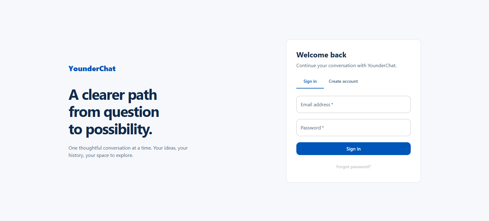
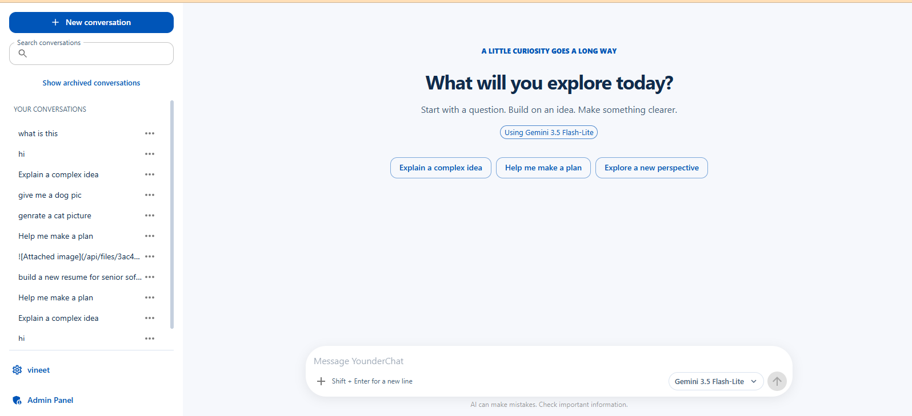

# YounderChat

A ChatGPT-style full-stack application built with React, TypeScript, Material UI, FastAPI, SQLAlchemy/Alembic and a provider abstraction for Gemini/Groq. This repository includes the app source, tests, Azure/Terraform deployment assets and local reviewer setup.

> **Quick start for reviewers:** Python 3.12+, Node.js 22+ and npm are enough. No Azure account, production database, Docker, email service or cloud credentials are required for local review. Run `./scripts/run-local.sh` on Linux/macOS or `./scripts/run-local.ps1` in Windows PowerShell.

## System architecture

~~~mermaid
flowchart LR
  UI["Browser UI<br/>React + TypeScript + MUI"]
  API["FastAPI<br/>REST + auth + authorization"]
  GEN["Generation service<br/>normalized streaming + stop"]
  DB[("Data store<br/>Local: SQLite<br/>Deployed: private PostgreSQL")]
  P["Provider abstraction<br/>model policy + adapters"]
  G["Gemini API"]
  R["Groq API"]
  UI -->|"HTTP / session cookie / CSRF"| API
  API <--> DB
  API --> GEN
  GEN <--> DB
  GEN --> P
  P -->|"server-side key"| G
  P -->|"server-side key"| R
  subgraph Azure["Production delivery"]
    GH["GitHub Actions + OIDC"]
    TF["Terraform"]
    ACR["Azure Container Registry"]
    ACA["Azure Container Apps"]
    PG["Azure Database for PostgreSQL<br/>private networking"]
    KV["Key Vault + managed identity"]
    GH --> ACR --> ACA
    GH --> TF --> ACA
    TF --> PG
    KV -. "secret references" .-> ACA
  end
  ACA --> API
  API <--> PG
~~~

For the expanded system diagram, request flow and deployment explanation, see [System Architecture](docs/architecture.md).

## Run locally (recommended for interview)

### Linux / macOS

From the repository root:

```bash
chmod +x scripts/run-local.sh
./scripts/run-local.sh
```

### Windows PowerShell

From the repository root:

```powershell
Set-ExecutionPolicy -Scope Process Bypass
.\scripts\run-local.ps1
```

The launcher creates a Python virtual environment, installs the locked backend dependencies and frontend dependencies, initializes a local SQLite database, seeds the two demo accounts, and starts both API and UI processes.

- **Web app:** http://localhost:5173
- **API docs:** http://localhost:8000/api/docs
- **API health:** http://localhost:8000/api/health/live
- **Database:** `backend/local.db` (local-only; ignored by Git)

### Local demo accounts

| Role | Email | Password |
| --- | --- | --- |
| Admin | `admin@younderchat.local` | `AdminDemo!2026` |
| Basic user | `user@younderchat.local` | `UserDemo!2026` |

These are intentionally predictable credentials for a disposable local interview database only. The seeding script refuses non-SQLite database URLs. Do not reuse these credentials in any shared or production environment.

### Enable real LLM responses (optional)

The app can run without provider keys, but actual model responses require a valid provider API token. Set one or both keys in the shell **before** running the launcher; the key stays in the backend environment and is never exposed to frontend code.

Linux/macOS:
```bash
export GEMINI_API_KEY="your-gemini-api-key"
# or
export GROQ_API_KEY="your-groq-api-key"
./scripts/run-local.sh
```

Windows PowerShell:
```powershell
$env:GEMINI_API_KEY = "your-gemini-api-key"
# or
$env:GROQ_API_KEY = "your-groq-api-key"
.\scripts\run-local.ps1
```

Use your own provider account and check its current quota/model access. A configured token does not guarantee provider availability. If no key is configured, authentication, account settings and persisted history can still be reviewed; the chat generation feature will report that a provider is unavailable. The browser-test fixture is for automated tests only and is not real AI inference.

To reset the local demo database, stop the launcher and delete `backend/local.db`; the next launch recreates it and reseeds the demo users.

## Application features

Implemented in the current codebase:

- **Authentication and security:** account registration/login, cookie-based sessions, password change/recovery flows, email verification integration, session revocation and controlled admin role.
- **Authorization and account administration:** user roles, admin user/plan management, seat invitations, account and session controls, audit records.
- **Chat:** conversation creation, persisted messages, streamed generation, stop, regenerate, edit/branch, follow-up continuity and model selection.
- **History:** cursor-paginated history, search, rename, archive/unarchive, delete and Markdown/JSON export.
- **Rich content:** Markdown, tables, syntax-highlighted code, charts and bounded image upload/display.
- **Settings:** profile, appearance/theme, contrast, plan/usage and security settings.
- **Usage controls:** plan entitlements, request/token reservations, per-user/app limits and usage records.
- **Testing:** backend tests, frontend unit tests and Playwright browser tests; CI uses an explicit deterministic provider fixture for repeatability.
- **Deployment assets:** Docker image/Compose, Terraform-managed Azure resources, GitHub Actions CI/CD, OIDC, Key Vault and managed identities.

### Important feature boundaries

- Payment collection, payment-provider webhooks and invoices are **not implemented**. Plans are assigned/administered within the app.
- Image upload/display is supported, but a complete end-user image-understanding workflow is **not implemented or verified**.
- Web search, image generation, document retrieval, voice, scheduled tasks and sandboxed code execution are **not exposed as working features**.
- Provider adapters exist, but live inference depends on valid credentials, current provider model IDs, quota and provider availability.
- The local SQLite setup is for convenient review only. Production uses PostgreSQL and Azure infrastructure; local scripts intentionally do not deploy or access cloud resources.

See [Implementation Plan](docs/implementation-plan.md) for current scope/status and [Backend README](backend/README.md) for backend and migration details.

## Public  demo

The demo endpoint is https://aichat.sdigurukulam.in/. The hostname uses the developer's personal domain registered/managed through GoDaddy and was configured specifically for this interview demonstration; it is not a Blue Yonder-owned domain. Verify current deployment and real provider inference independently before describing them as live-tested.

## Screenshots

These screenshots show the application UI. Chat screenshots use a clearly labelled deterministic browser-test fixture, not real model inference.




## Developer checks

Run commands from the repository root after installing dependencies:

```bash
.venv/bin/ruff check backend
.venv/bin/python -m pytest backend/tests
npm --prefix frontend run build
npm --prefix frontend run lint
npm --prefix frontend run test
```

On Windows, use `.venv\Scripts\python.exe` and `.venv\Scripts\ruff.exe` instead of the Linux virtualenv paths. Browser tests use an isolated PostgreSQL test database and Playwright; they are separate from the SQLite local demo launcher.

## Repository layout

- `frontend/` — React/TypeScript application and browser tests.
- `backend/` — FastAPI routes, domain services, models, schemas and Alembic migrations.
- `docs/architecture.md` — detailed architecture and deployment diagram.
- `docs/implementation-plan.md` — product scope, implementation status and acceptance criteria.
- `infra/` — Docker, Terraform roots/modules, Azure deployment and pipeline scripts.
- `scripts/run-local.sh`, `scripts/run-local.ps1` — cross-platform local demo launchers.
- `.kiro/steering/` — project coding, UI, API and infrastructure guidance.
